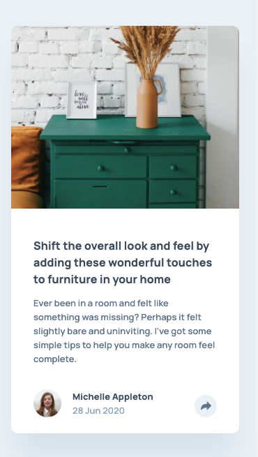
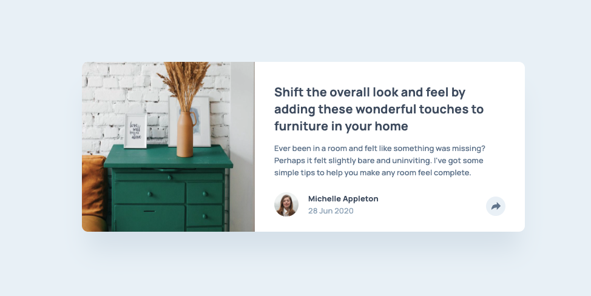

# Frontend Mentor - Article preview component solution<!-- omit in toc -->

## Mobile<!-- omit in toc -->

## Desktop<!-- omit in toc -->

## Table of contents<!-- omit in toc -->

- [Overview](#overview)
  - [The challenge](#the-challenge)
  - [Links](#links)
- [My process](#my-process)
  - [Built with](#built-with)
- [Author](#author)

## Overview

### The challenge

Users should be able to:

- View the optimal layout for the component depending on their device's screen size
- See the social media share links when they click the share icon

### Links

- [GitHub repo](https://github.com/awesomeCoding999/frontend-mentor-article-preview)
- [Live site](https://frontend-mentor-article-preview-navy.vercel.app/)

## My process

### Built with

- Semantic HTML5 markup
- CSS custom properties
- Flexbox
- Mobile-first workflow
- [React](https://reactjs.org/)
- [TypeScript](https://www.typescriptlang.org/)

## Author

- Frontend Mentor - [@awesomeCoding999](https://www.frontendmentor.io/profile/awesomeCoding999)
